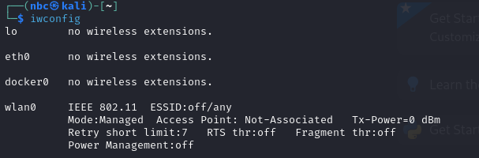
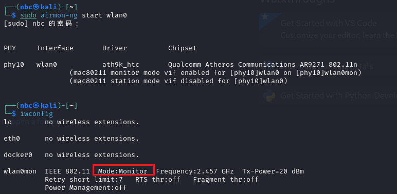
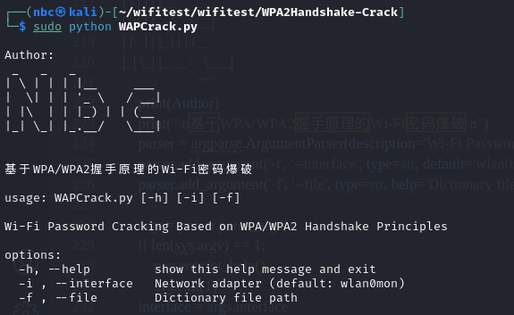
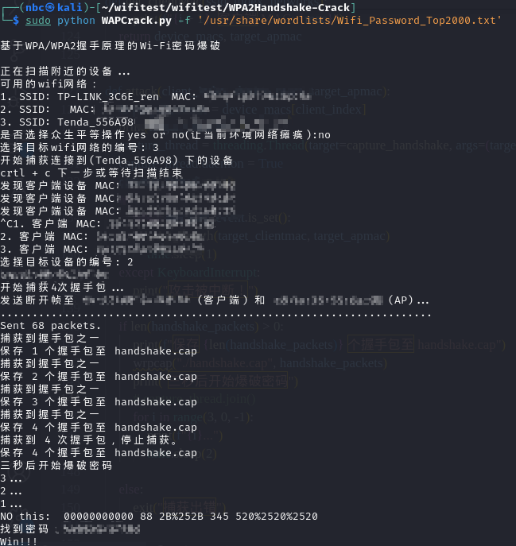

该项目是基于WPA/WPA2握手原理的Wi-Fi密码爆破

分析文章可以看这：[[原创\]一次研究如何获得wifi密码的过程-智能设备-看雪-安全社区|安全招聘|kanxue.com](https://bbs.kanxue.com/thread-285383.htm)

**主要用于了解学习WPA/WPA2**

**首先要具备一个可以监听的网卡**

使用iwconfig可以查看

```
iwconfig
```



将网卡设置为监听模式

```
sudo airmon-ng start wlan0
```



```
sudo python WAPCrack.py
```



-i 指定网卡，如果用**airmon-ng**启动则一般默认为wlan0mon

-f 指定爆破的字典

```
sudo python WAPCrack.py -f 'list.txt'
```




